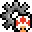

If you are using this code in your own project, please cite our paper:

```
@inproceedings{awiszus2020toadgan,
  title={TOAD-GAN: Coherent Style Level Generation from a Single Example},
  author={Awiszus, Maren and Schubert, Frederik and Rosenhahn, Bodo},
  booktitle={Proceedings of the AAAI Conference on Artificial Intelligence and Interactive Digital Entertainment},
  year={2020}
}
```

# TOAD-GUI

**TOAD-GUI** is a Framework with which _Super Mario Bros._ levels can be randomly generated, loaded, saved, edited and played using a graphical user interface.
Generation is done with pre-trained **TOAD-GAN** (**T**oken-based, **O**ne-shot, **A**rbitrary **D**imension **G**enerative **A**dversarial **N**etwork). 
For more information on **TOAD-GAN**, please refer to the paper ([arxiv link](https://arxiv.org/pdf/2008.01531.pdf)) and the [Github](https://github.com/Mawiszus/TOAD-GAN).

<p align="center">

</p>

This project uses the [Mario-AI-Framework](https://github.com/amidos2006/Mario-AI-Framework) by [Ahmed Khalifa](https://scholar.google.com/citations?user=DRcyg5kAAAAJ&hl=en) and includes graphics from the game _Super Mario Bros._ **It is not affiliated with or endorsed by Nintendo.
The project was built for research purposes only.**

### AIIDE 2020

Our paper "TOAD-GAN: Coherent Style Level Generation from a Single Example" was accepted for oral presentation at [AIIDE 2020](https://webdocs.cs.ualberta.ca/~santanad/aiide/index.html)!
You can find our video presentation on [YouTube](https://youtu.be/_bnAtIYVx-s).

Our code for TOAD-GUI and TOAD-GAN has been accepted for the AIIDE 2020 Artifact Evaluation Track! 
It will be recognized in the [AIIDE 2020 Program](https://webdocs.cs.ualberta.ca/~santanad/aiide/program.html).

## Getting Started

This section includes the necessary steps to get TOAD-GUI running on your system.

### Python

You will need [Python 3](https://www.python.org/downloads) and the packages specified in requirements.txt.
We recommend setting up a [virtual environment with pip](https://packaging.python.org/guides/installing-using-pip-and-virtual-environments/)
and installing the packages there.

```
$ pip3 install -r requirements.txt -f "https://download.pytorch.org/whl/torch_stable.html"
```
Make sure you use the `pip3` that belongs to your previously defined virtual environment.

The GUI is made with [Tkinter](https://wiki.python.org/moin/TkInter), which from Python 3.7 onwards is installed by default.
If you don't have it installed because of an older version, follow the instructions [here](https://tkdocs.com/tutorial/install.html).

### Java

TOAD-GUI uses the [Mario-AI-Framework](https://github.com/amidos2006/Mario-AI-Framework) to play the generated levels.
For the Framework to run, [Java 11](https://adoptopenjdk.net/releases.html) (or higher) needs to be installed.

## Running TOAD-GUI

Once all prerequisites are installed, TOAD-GUI can be started by running main.py.
```
$ python main.py
```
Make sure you are using the python installation you installed the prerequisites into.

### TOAD-GUI

When running TOAD-GUI you can:
*  Open a Folder containing a Generator (TOAD-GAN)
*  Open a (previously saved) level `.txt` to view and/or play
*  Generate a level of the size defined in the entries below
*  Save the currently loaded level level to a `.txt` or `.png` image file
*  Play the currently loaded level

**NOTE:** When a generator is opened, it will not show any files in the dialog window. 
That is intended behavior for `askdirectory()` of tkinter. Just navigate to the correct path and click "Open" regardless.

When a level is loaded, **right clicking** a point in the preview will allow you to change the token at that specific spot.
If you resample the level, any changes made will be lost.

The labels at the bottom will display the currently loaded path and information. 
This program was made mostly by one researcher and is not optimized.
Impatiently clicking buttons might crash the program.

#### Edit Mode
In this mode, parts of a generated level can be resampled with TOAD-GAN. 
The red bounding box shows the area to be changed, while the yellow bounding box shows which blocks can still be affected by that change.
The area of effect depends on the scale which is to be resampled and is a result of the Field of View produced by the convolutional layers.
Changes in a lower scale will result in larger changes in the final level.

Use the control panel to set the bounding box. The representation inside the panel shows which pixels in the noise map will be changed.


Resample the noise map in the chosen scale. The "Noise influence" is a learned parameter that indicates how big the effect of resampling in this scale will be.


Scale 0 is the first scale and results in the most changes. Note that the tokens outside of the bounding box change. 
This is because of the field of view from the convolutional layers applied to the noise map.


You can right click a token you want to change and replace it with another token present in the level.
This should be done after resampling, as resampling will regenerate the level from the noise maps which will undo these edits.


### TOAD-GAN

If you are interested in training your own Generator, refer to the [TOAD-GAN Github](https://github.com/Mawiszus/TOAD-GAN) and copy the folder of your trained generator into the `generators/` folder.
You should now be able to open it just like the provided generators.

The necessary files are:
```
generators.pth
noise_amplitudes.pth
noise_maps.pth
num_layer.pth
reals.pth
token_list.pth
```
Any other files can be deleted if you want to keep your folders tidy.

**NOTE:** When a generator is opened, it will not show these files in the dialog window. 
That is intended behavior for `askdirectory()` of tkinter. Just navigate to the correct path and click "Open" regardless.


## Known Bugs

* If the level play is quit using the window ('x' button in the corner), an **error message regarding py4j** will occur.
In spite of that, the program should continue running normally.


* If you have two monitors with different resolutions, the GUI and the Java window **might not be displayed in the correct resolution**.
Try moving the windows to the monitor with the other resolution if you encounter this problem.
You can also change the DPI awareness for the program in the beginning of GUI.py.

## Built With

* Tkinter - Python package for building GUIs
* py4j - Python to Java interface
* Pillow - Python Image Library for displaying images
* Pytorch - Deep Learning Framework
* Maven - Used for building the Mario-AI-Framework

## Authors

* **[Maren Awiszus](https://www.tnt.uni-hannover.de/de/staff/awiszus/)** - Institut für Informationsverarbeitung, Leibniz University Hanover
* **[Frederik Schubert](https://www.tnt.uni-hannover.de/de/staff/schubert/)** - Institut für Informationsverarbeitung, Leibniz University Hanover

## Copyright

This program is not endorsed by Nintendo and is only intended for research purposes. 
Mario is a Nintendo character which the authors don’t own any rights to. 
Nintendo is also the sole owner of all the graphical assets in the game.

